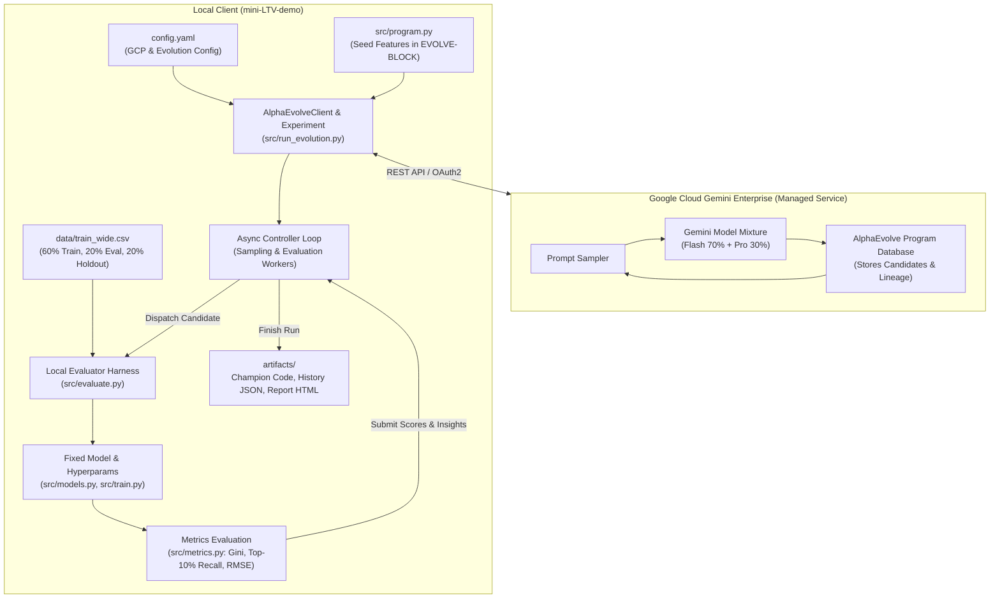
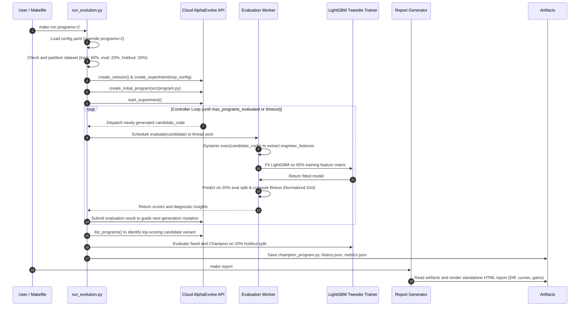

# AlphaEvolve LTV Feature Engineering Optimization System Design (DESIGN.md)

**English** | [简体中文](DESIGN_CN.md)

This document specifies the system architecture and implementation plan based on [TASK_SPEC.md](TASK_SPEC.md), converting the existing **LightGBM (Tweedie distribution, $`p=1.5`$)** mobile game LTV forecasting baseline into an automated feature engineering optimization system powered by Google Cloud **AlphaEvolve** (Gemini-driven evolutionary coding agent).

> 📘 **Related Documentation**:
> - For environment setup and user guides, see [README.md](README.md).
> - For modeling benchmarks and Tweedie mathematical derivations, see [INSIGHT.md](INSIGHT.md).

---

## 1. System Objectives & Design Principles

1. **Frozen Base Model Architecture & Hyperparameters**:
   - The underlying LightGBM Tweedie tree model hyperparameters (num_leaves: 31, learning_rate: 0.05, variance power: $`p=1.5`$) remain strictly frozen. The evolutionary search focuses exclusively on **Feature Engineering** discovery and transformations.
   - Original code is retained in `src/`, wrapped and invoked via external modular wrappers to minimize invasiveness.
   - The mutable feature engineering block is explicitly bounded by `# EVOLVE-BLOCK-START` and `# EVOLVE-BLOCK-END`.
2. **Scientific 3-Way Balanced Partitioning (60% / 20% / 20%)**:
   - The full wide table `data/train_wide.csv` (75,464 players) is partitioned into:
     - **Training Split `train_split.csv` (60%)**: Used by candidate variants across evolutionary generations to fit the LightGBM model.
     - **Evaluation Split `eval_split.csv` (20%)**: Used during evolution to score candidates, providing feedback to guide Gemini mutations and crown the Champion code.
     - **Holdout Split `holdout_split.csv` (20%)**: Strictly air-gapped from the evolutionary loop, evaluated only once post-run for an unbiased comparison between the Seed Baseline and Champion.
   - Stratification combines target LTV deciles, early payment velocity tiers, and operating platform (iOS/Android), guaranteeing identical zero-inflation rates and whale distributions across all three splits.
3. **Single Source of Truth (`config.yaml`)**:
   - Centralizes GCP project settings (`PROJECT_ID: <YOUR_GCP_PROJECT_ID>`, `GE_APP_ID: <YOUR_GE_APP_ID>`), evolutionary hyperparameters, Gemini foundation model mixture weights (Gemini 3.5 Flash 70% + Gemini 3.1 Pro 30%), and parallel evaluation flags. No hidden `.env` files.
4. **Flexible & Configurable `alpha_evolve` SDK Import**:
   - Seamlessly imports from either the local `alpha_evolve/` directory or an external system path, while strictly **never modifying** any file within the official `alpha_evolve` library.
5. **High-Throughput Parallel Evaluation with Resilient Sandboxing**:
   - Configures `parallel_evaluation=True` and `ThreadPoolExecutor` to leverage multi-core CPU concurrency during model fitting.
   - Fault tolerance: Any candidate syntax errors, schema mismatches, or execution exceptions are caught gracefully, returning a penalized baseline score (`-1e12`) alongside structured diagnostic `insights` to guide Gemini's self-repair in subsequent iterations.
6. **Robust Tooling & Standalone Visualization**:
   - Standardized `Makefile` workflow (`setup`, `auth`, `run`, `report`, `test`), supporting CLI budget overrides via `make run programs=2`.
   - `make report` generates a standalone interactive HTML dashboard featuring convergence trajectories, seed vs. champion code diffs, multi-metric gain comparisons, and domain-infused attribution insights.

---

## 2. System Architecture & Workflow Topology

### 2.1 Architectural Topology



### 2.2 Sequence & Interaction Flow



---

## 3. Directory Structure & Component Manifest

| Path / File | Role & Implementation Details |
| :--- | :--- |
| **`config.yaml`** | **Single Source of Truth**: GCP credentials, evolution budget, LLM weights, dataset split ratios, parallel evaluation toggle, and `alpha_evolve_path`. |
| **`Makefile`** | **Unified CLI**: `setup`, `auth`, `run` (supports `programs=N`, `metric=...`), `report`, `split`, `clean`, `mask`, `unmask`. |
| **`requirements.txt`** | Dependency manifest (LightGBM, Polars, Pandas, Scikit-learn, Pydantic, Google-auth, PyYAML). |
| **`venv/`** | Python 3.11 isolated virtual environment directory. |
| **`alpha_evolve/`** | **Strictly Read-Only**: Google Cloud AlphaEvolve official Python SDK. |
| **`src/`** | **Core Implementation Source** (modeled after `examples/circle_packing/src`): |
| ├── `src/program.py` | Seed program module: Contains `engineer_features(df)` bounded by `# EVOLVE-BLOCK-START` and `# EVOLVE-BLOCK-END`. |
| ├── `src/evaluate.py` | Candidate evaluator harness: Sandboxed execution, exception trapping, score formatting, and `AlphaEvolveEvaluationInsight` generation. |
| ├── `src/run_evolution.py` | Master controller: Experiment initialization, async scheduling, champion selection, and holdout benchmarking. |
| ├── `src/dataset.py` | Data management: 3-way balanced stratified splitting (60/20/20) and baseline feature engineering. |
| ├── `src/models.py` | Frozen model wrapper (LightGBM Tweedie, $`p=1.5`$). |
| ├── `src/metrics.py` | Metric suite: RMSE, MAE, Normalized Gini, Top-10% Revenue Recall, Spearman Rank Correlation. |
| ├── `src/config.py` | Lightweight Python configuration mapper and dynamic library loader. |
| ├── `src/report.py` | Interactive HTML report generator: Convergence trajectories, code diff inspection, and attribution engine. |
| **`artifacts/`** | Artifact storage: Isolated directories storing `seed_program.py`, `champion_program.py`, `evolution_history.json`, `champion_metrics.json`, and `evolution_report.html`. |
| **`data/`** | Dataset directory: `train_wide.csv`, `train_split.csv`, `eval_split.csv`, `holdout_split.csv`. |
| **`tests/`** | Test suite: Stratification distribution balance, evaluator resilience, configuration parsing, and credential sanitization. |
| **`README.md`** | User manual and developer guide (English). |

---

## 4. Detailed Module Architecture

### 4.1 Balanced 3-Way Stratified Partitioning (`src/dataset.py`)

The partitioning logic divides the raw user dataset into distribution-consistent splits:
- Default proportions: `train_ratio: 0.60`, `eval_ratio: 0.20`, `holdout_ratio: 0.20` (customizable via `config.yaml`).
- Stratification methodology:
  1. 10 quantiles of positive `ltv_d8_d180` values create 11 target value bins.
  2. Early observation window monetization (`total_revenue_d7`) defines early spend tiers.
  3. Operating system (`platform`: iOS / Android) defines acquisition channel.
  4. Composite strata labels first isolate the 20% `holdout_split.csv`. The remaining 80% is partitioned into `train_split.csv` ($`60/80 = 75\%`$) and `eval_split.csv` ($`20/80 = 25\%`$).
- Ensures identical positive conversion ratios, average LTV, and whale distributions across all three splits.

### 4.2 Seed Code & Evolution Boundaries (`src/program.py` & `src/dataset.py`)

The evolvable boundary in `src/program.py` and `src/dataset.py` is marked with standard delimiters:

```python
# EVOLVE-BLOCK-START
def engineer_features(df: pd.DataFrame) -> pd.DataFrame:
    """Computes domain-specific interaction and momentum features for mobile game LTV."""
    df = df.copy()

    # Revenue momentum across observation window
    df["early_rev_d0_d2"] = df["revenue_d0"] + df["revenue_d1"] + df["revenue_d2"]
    df["late_rev_d5_d7"] = df["revenue_d5"] + df["revenue_d6"] + df["revenue_d7"]
    df["rev_growth_ratio"] = (df["late_rev_d5_d7"] + 0.01) / (df["early_rev_d0_d2"] + 0.01)

    # Unit metrics
    df["ad_rev_per_imp"] = df["ad_revenue_usd_sum"] / (df["ad_impression_count"] + 1e-4)
    df["events_per_active_day"] = df["total_events"] / (df["active_days_count"] + 1e-4)
    df["active_day_ratio"] = df["active_days_count"] / 8.0
    df["iap_share"] = df["iap_revenue_usd_sum"] / (df["total_revenue_d7"] + 1e-4)

    return df
# EVOLVE-BLOCK-END
```

An isolated `evaluate(eval_inputs)` entry point in `src/program.py` supports standalone unit testing.

### 4.3 Local Candidate Evaluator (`src/evaluate.py`)

- **Sandboxed Dynamic Execution**:
  Compiles candidate code received from the AlphaEvolve service dynamically:
  ```python
  exec_namespace = {"np": np, "pd": pd, ...}
  exec(candidate_code, exec_namespace)
  engineer_func = exec_namespace.get("engineer_features")
  ```
- **Data Flow & Model Fitting**:
  1. Reuses in-memory baseline DataFrames to eliminate redundant disk I/O.
  2. Applies candidate transformations to produce $`X_{\mathrm{train}}`$ and $`X_{\mathrm{eval}}`$.
  3. Sanitizes newly engineered features against NaN / Inf values with median/zero imputation.
  4. Fits the frozen `LightGBMTweedieModel(tweedie_variance_power=1.5)` on training data.
  5. Predicts $`\hat{y}_{\mathrm{eval}}`$ on the evaluation split.
- **Primary & Secondary Metric Computation**:
  - **Primary Metric**: `normalized_gini` (Range $`[0, 1]`$, higher is better).
  - **Auxiliary Metrics**: `top_10_recall`, `neg_rmse` (negative RMSE, higher is better), `spearman_corr`.
- **Diagnostic Feedback & Error Containment**:
  Syntax errors, column missing exceptions, and runtime timeouts are intercepted gracefully, generating an `AlphaEvolveEvaluationInsight` with a baseline penalty (`-1e12`) to guide Gemini away from similar errors in future generations.

### 4.4 Evolution Controller & Artifact Isolation (`src/run_evolution.py`)

- Reads `config.yaml`, supporting command-line overrides via `--programs N` (`max_programs_generated = N` and `max_programs_evaluated = N`).
- Initializes `AlphaEvolveClient`, establishing a Gemini Enterprise session and experiment.
- Registers `src/program.py` as the initial program seed.
- Executes `run_controller_loop` with `parallel_evaluation=True` and `num_evaluators=WORKER_CONCURRENCY`.
- Identifies the top-ranking candidate variant via `list_programs`.
- Runs unbiased evaluation of Seed vs. Champion on the **20% Holdout Split**, saving structured outputs to `artifacts/`.
- **Automated Task ID Generation**: Automatically assigns a unique `task_YYYYMMDD_HHMMSS` timestamp identifier if `--task-id` is omitted.
- **Physical Artifact Isolation**: All run artifacts are saved under `artifacts/<task_id>/` (`champion_program.py`, `seed_program.py`, `evolution_history.json`, `champion_metrics.json`, `evolution_report.html`).
- **Latest Pointer Maintenance**: Updates the `latest` symlink and `latest_task.txt` pointer in the root `artifacts/` folder.

### 4.5 Champion Metric Rationale & Dynamic Selection

#### 4.5.1 Trade-Offs Across the Four Evaluation Metrics
In 180-day mobile game LTV forecasting, each metric captures distinct business and statistical dynamics:
- **Normalized Gini (Default Benchmark)**:
  - *Mechanism*: Measures Lorenz curve coverage of cumulative predicted revenue against ideal cumulative actual revenue (range $`[0, 1]`$). Robust against extreme single-whale spending spikes.
  - *Best Fit*: Ideal primary metric for full-lifecycle user acquisition (UA bidding) and broad cohort tiering.
- **Top-10% Revenue Recall**:
  - *Mechanism*: Percentage of total server revenue contributed by players predicted in the top 10% highest-value tier.
  - *Trade-Off*: F2P monetization (especially SLG and MMO titles) relies heavily on top whales (generating 70%~85% of total revenue). Optimizing for this metric strongly boosts whale identification features, though it may slightly loosen rank ordering across non-paying cohorts.
- **RMSE / neg_rmse**:
  - *Mechanism*: Measures absolute Euclidean distance between predicted and actual dollar revenues.
  - *Trade-Off*: Because LTV exhibits Pareto heavy-tailed skewness, squared residuals from multi-thousand-dollar whales can dominate the loss function, potentially causing the model to overfit outlier spenders at the expense of general cohort stability.
- **Spearman Rank Correlation**:
  - *Mechanism*: Evaluates monotonic rank consistency, entirely invariant to non-linear monotonic shifts or scale variations.

#### 4.5.2 Dynamic Metric Selection
Users can specify the primary champion selection metric via `--metric` (with fault-tolerant aliases: `gini`, `recall`, `rmse`, `spearman`):
1. **Directs LLM Mutation Focus**: Injects the chosen metric into the cloud experiment configuration as the primary objective.
2. **Concurrent Multi-Metric Scoring**: The local evaluation harness calculates all four metrics simultaneously, returning the target metric as the core fitness score.
3. **Aligned Champion Ranking**: At the conclusion of the evolution loop, candidates are re-ranked according to the designated metric to select the definitive Champion.
4. **Visual Prominence**: The HTML report applies an amber halo and dedicated champion badge (`👑 Champion Selection Metric`) to the active metric.

### 4.6 Universal Code Evolution Attribution Engine

#### 4.6.1 Universal Architecture Beyond Feature Engineering
In real-world AlphaEvolve workflows, mutable blocks (`# EVOLVE-BLOCK`) can encapsulate diverse algorithmic components:
1. **Model Hyperparameters**: Tree depth, learning rates, subsampling ratios, or architectural choices.
2. **Custom Objective & Loss Functions**: Asymmetric Tweedie losses, whale-weighted penalties, or custom gradients.
3. **Data Sampling & Preprocessing**: Dynamic Winsorization, inverse propensity weighting, or focal resampling.
4. **Post-Processing & Calibration**: Probability calibration, isotonic regression, or quantile thresholding.

To support broad evolutionary scopes, the system features an **adaptive multi-scope attribution engine** (`src/domain_context.py` and `src/report.py`).

#### 4.6.2 Domain Knowledge Base Injection
System prompts inject structured F2P gaming domain knowledge prior to invoking Gemini for code attribution:
- **Core Business Model**: Hybrid monetization (IAP in-app purchases + rewarded video ads).
- **Time Horizon**: Predicts Day 8 to Day 180 cumulative revenue (`ltv_d8_d180`) using early Day 0 to Day 7 behavioral telemetry.
- **Scope Identification**: Prompts instruct the model to first infer the active `evolution_scope` (feature engineering, loss functions, hyperparameter optimization, sampling strategies, or end-to-end pipelines).

#### 4.6.3 Universal Schema & High-Availability Pipeline
1. **Universal Output Contract**: Standardized JSON containing `evolution_scope`, `evolution_summary`, `key_innovations` (with title, type, color badge, code snippet, mathematical mechanism, and business impact), `simplifications_and_pruning`, and `strategic_insights`.
2. **Local Cache Mode**: Attribution results persist to `artifacts/<task_id>/code_attribution.json`, enabling 50ms instantaneous report loading on subsequent views without API token consumption.
3. **Graceful Fallback Mode**: When offline or in unauthenticated CI/CD test environments, a diff-based AST parser infers code changes and populates baseline innovations automatically.

### 4.7 Compute & Resource Telemetry Dashboard

The reporting engine surfaces low-level execution telemetry directly from the Google Cloud Discovery Engine API:
1. **Execution Duration**: Tracks start time, end time, and total elapsed runtime (formatted as mm:ss).
2. **Model Call Breakdown**: Tallies total LLM invocations and splits counts by model (`gemini-3.5-flash`: 70% vs. `gemini-3.1-pro-preview`: 30%).
3. **Verified GCP Token Usage**: Extracts authentic `inputTokenCount` and `outputTokenCount` directly from cloud experiment `stats`.
4. **Local Throughput**: Measures local parallel worker throughput and candidate evaluation success rates.

### 4.8 Automated Report Delivery & Browser Integration

- **Autonomous Generation**: At the conclusion of `make run` (`src/run_evolution.py`), the system automatically compiles `evolution_report.html` in the task directory.
- **One-Click Browser Viewing**: `make report` opens the latest report in the user's default browser via `webbrowser.open`, with optional historical inspection via `make report task_id=...`.

### 4.9 Interactive Trajectory & Hover Tooltip Design

1. **Lightweight Native Implementation**: Built purely with SVG and Vanilla JavaScript, free of external dependencies (e.g. ECharts, Chart.js) for instant offline rendering.
2. **Full-Metric Data Binding**:
   - Program points bind HTML5 data attributes (`data-prog-id`, `data-is-champ`, `data-gini`, `data-recall`, `data-rmse`, `data-spearman`).
   - Mouse hover (`mouseenter`) smoothly magnifies the dot (normal to `r=8px`, Champion to `r=9.5px`) with a luminous halo.
   - A glassmorphic tooltip card tracks the cursor, displaying the candidate's complete evaluation matrix:
     - Candidate `#ID` and Champion badge;
     - Active primary optimization metric value;
     - `Normalized Gini (↑)`, `Top-10% Revenue Recall (↑)`, `RMSE Error (↓)` (restored to dollar currency), `Spearman Rank Correlation (↑)`.
3. **Adaptive Boundary Collision**:
   - Reverses tooltip orientation when nearing container edges, preventing off-screen clipping.
   - Employs native SVG `<title>` elements as fallbacks for headless rendering or PDF export.

### 4.10 Metric Directional Badges

1. **Directional Standardization**:
   - Benefit metrics (higher is better): Labeled `↑ Higher is better` with an emerald badge (`#34d399`), applied to Normalized Gini, Top-10% Recall, and Spearman Correlation.
   - Error metrics (lower is better): Labeled `↓ Lower is better` with a cyan badge (`#38bdf8`), applied to RMSE.
2. **Table & Card Integration**: The holdout comparison table features a dedicated **Optimization Direction** column, mirrored on summary metric cards.
3. **Sign Alignment**: AlphaEvolve's cloud optimizer maximizes `neg_rmse` internally; the report generation engine automatically converts this back into positive currency amounts with `↓ Lower is better` labeling.

### 4.11 Delivery Sanitization Architecture (`make mask` & `make unmask`)

An automated sanitization toolchain prepares codebases for client delivery or open-source release:
1. **Zero Hardcoded Secrets**: The script [`scripts/mask_credentials.py`](scripts/mask_credentials.py) contains no embedded keys or sensitive identifiers, extracting active credentials dynamically from `config.yaml`.
2. **Repository-Wide Sanitization**: Scans `config.yaml`, documentation, test suites, and `artifacts/` history, replacing credentials with `<YOUR_GCP_PROJECT_ID>` and `<YOUR_GE_APP_ID>`.
3. **Lightweight & Dry-Run Capable**: Built exclusively on Python 3 standard libraries (`sys`, `os`, `re`, `pathlib`, `argparse`). `make mask-dry` previews affected files without writing to disk.
4. **Secure Backup & Instant Restore**: `make mask` backs up active credentials to `.credentials.backup` (ignored by Git via `.gitignore`). `make unmask` restores the development environment in a single step. File format example:
   ```yaml
   # AlphaEvolve local credentials backup
   project_id: my-gcp-project-123
   ge_app_id: gemini-enterprise-12345678
   ```

---

## 5. Configuration Specification (`config.yaml`)

```yaml
# ==============================================================================
# Google Cloud AlphaEvolve LTV Forecasting Configuration
# ==============================================================================
# Single Source of Truth for GCP credentials, evolution hyperparameters,
# foundation model mixture, dataset split ratios, and evaluation settings.
# ==============================================================================

# 1. Google Cloud & Gemini Enterprise Service Settings
gcp:
  project_id: "<YOUR_GCP_PROJECT_ID>"
  location: "global"
  collection: "default_collection"
  ge_app_id: "<YOUR_GE_APP_ID>"
  assistant: "default_assistant"
  base_url: "discoveryengine.googleapis.com"
  alpha_evolve_path: "./alpha_evolve"

# 2. Evolution Control & Hyperparameters
evolution:
  max_programs_generated: 20       # Maximum program generation budget
  max_programs_evaluated: 20       # Maximum program evaluation budget
  concurrency: 4                   # Cloud generation concurrency
  worker_concurrency: 4            # Local evaluation worker threads
  parallel_evaluation: true        # Multi-threaded candidate evaluation
  idle_timeout_s: 120              # Timeout waiting for new programs (seconds)
  primary_metric: "normalized_gini" # Optimization target (normalized_gini, top_10_recall, neg_rmse, spearman_corr)

# 3. Gemini Foundation Model Mixture Weights
models:
  - name: "gemini-3.5-flash"
    weight: 0.70
  - name: "gemini-3.1-pro-preview"
    weight: 0.30

# 4. Dataset Partitioning (Full train_wide.csv Split)
dataset:
  raw_wide_path: "./data/train_wide.csv"
  train_split_path: "./data/train_split.csv"
  eval_split_path: "./data/eval_split.csv"
  holdout_split_path: "./data/holdout_split.csv"
  train_ratio: 0.60
  eval_ratio: 0.20
  holdout_ratio: 0.20
  random_state: 42
```

---

## 6. Makefile Command Reference

```makefile
# Core Command Suite
make setup       # Create venv virtual environment and install requirements.txt
make auth        # Execute gcloud auth application-default login
make split       # Partition data/train_wide.csv into balanced 60/20/20 splits
make run         # Run evolution (supports programs=N, metric=gini|recall|rmse|spearman, task_id=ID)
make report      # Open HTML report in default browser (supports task_id=ID)
make test        # Run automated test suite under tests/
make mask        # Anonymize project credentials with placeholders and save local backup
make mask-dry    # Preview masked files and replacement counts without disk writes
make unmask      # Restore credentials from local .credentials.backup (or pass PROJECT_ID=... APP_ID=...)
make clean       # Clean Python caches and temporary files
```

---

## 7. Implementation Roadmap & Milestones

| Milestone | Objective | Core Deliverables | Acceptance Criteria |
| :--- | :--- | :--- | :--- |
| **Phase 1** | Environment & Dependencies | `venv/`, `requirements.txt` | `venv/bin/python` loads all dependencies and imports `alpha_evolve` cleanly. |
| **Phase 2** | Balanced 3-Way Split | `src/dataset.py`, `data/*.csv` | `train_wide.csv` partitions into 60/20/20 splits (45,278 / 15,093 / 15,093 rows) with matching distributions. |
| **Phase 3** | Seed Code & Evolution Boundaries | `src/program.py`, `src/dataset.py` | Bounded by `# EVOLVE-BLOCK-START` and `END`, passes isolated unit test execution. |
| **Phase 4** | Local Evaluator Harness & Controller | `src/evaluate.py`, `src/run_evolution.py`, `src/config.py` | Sandboxed candidate execution, multi-threaded fitting, metric extraction, and diagnostic error reporting. |
| **Phase 5** | HTML Report Generator | `src/report.py`, `Makefile` | `make report` renders trajectories, code diffs, and metric gain tables. |
| **Phase 6** | End-to-End Validation | `make run programs=2` | Executes successfully, generating and evaluating 2 variants, outputting champion code and holdout comparisons. |
