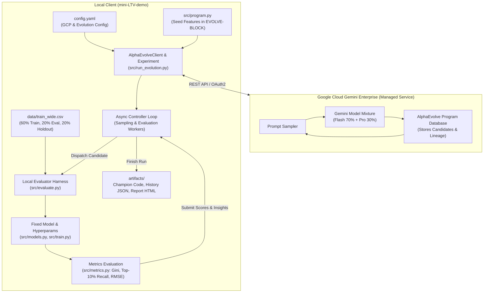
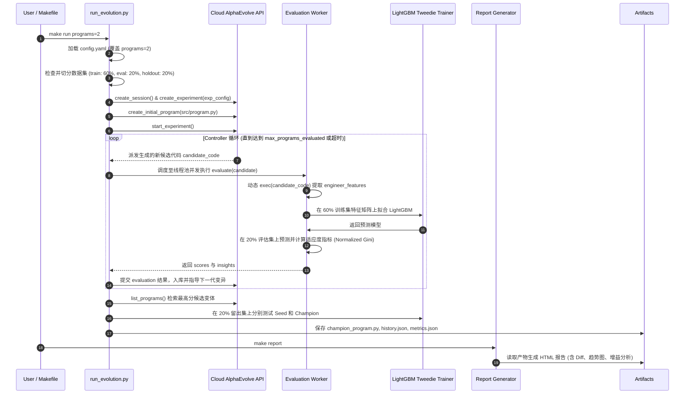

# AlphaEvolve LTV 特征工程自动优化系统设计方案 (DESIGN.md)

本文档根据 [TASK_SPEC.md](TASK_SPEC.md) 的要求制定，旨在将本项目现有的 **LightGBM (Tweedie分布, $`p=1.5`$)** 移动游戏 LTV 预测基线改造为支持 Google Cloud **AlphaEvolve**（基于 Gemini 驱动的演化编码智能体）自动搜索与优化特征工程的系统。

---

## 1. 系统目标与设计原则

1. **原始模型与超参数严格冻结**：
   - 保持现有的 LightGBM Tweedie 树模型超参数（树叶数 31、学习率 0.05、方差幂 $`p=1.5`$ 等）不变，只将演化能力集中在**特征工程（Feature Engineering）**的发现与构造上。
   - 原始代码保留在 `src/` 中，采用外层 Wrapper 模块包裹与调用的形式，降低侵入性。
   - 在原始代码特征工程定义处注入 `# EVOLVE-BLOCK-START` 与 `# EVOLVE-BLOCK-END` 标记。
2. **科学三向数据集切分（60% / 20% / 20%）**：
   - 全量用户宽表 `data/train_wide.csv`（75,464 用户）切分为：
     - **训练集 `train_split.csv` (60%)**：用于各轮演化生成的候选代码拟合 LightGBM 模型。
     - **评估集 `eval_split.csv` (20%)**：用于在演化过程中评估候选变体，反馈评分引导 Gemini 演化并遴选冠军代码（Champion）。
     - **留出集 `holdout_split.csv` (20%)**：严格物理隔离，不参与演化选择，仅在最终对比冠军代码与种子基线的真实泛化能力。
   - 切分算法采用“目标 LTV 十等分位 + 早期付费梯度 + 平台”的复合分层，确保三份数据集在零膨胀比例、长尾巨鲸分布上高度一致。
3. **单点真实源全局配置 (`config.yaml`)**：
   - 统一管理 GCP 项目配置（`PROJECT_ID: <YOUR_GCP_PROJECT_ID>`、`GE_APP_ID: <YOUR_GE_APP_ID>`）、演化控制参数、Gemini 模型混合权重（Gemini 3.5 Flash 70% + Gemini 3.1 Pro 30%）、并行评估配置等，杜绝散落的配置或隐藏的 `.env` 文件。
4. **灵活可配置的 `alpha_evolve` 导入机制**：
   - 保证本项目在当前目录 `alpha_evolve/` 或系统外部路径均可正常导入，且严格**不修改**官方 `alpha_evolve` 库中的任何代码。
5. **高效并行评估与安全沙箱**：
   - 采用 `parallel_evaluation=True` 与 `ThreadPoolExecutor`，充分发挥本地多核 CPU 并发评估能力。
   - 异常捕获与惩罚机制：变体执行崩溃或返回非法值时，返回保底低分（`-1e12`）并生成诊断 `insights` 供 Gemini 自我纠错。
6. **完备工程化工具链与结果可视化**：
   - 包含标准化的 `Makefile`（`setup`, `auth`, `run`, `report`, `test`），支持 `make run programs=2` 动态参数覆盖。
   - `make report` 自动生成独立的交互式 HTML 格式演化总结报告（包含演化历史收敛图、种子 vs 冠军代码 Diff 与改进摘要、多维指标增益对比）。

---

## 2. 整体架构与流程设计

### 2.1 架构拓扑图



### 2.2 演化与评估时序交互



---

## 3. 目录结构与模块划分对照

| 路径 / 文件名 | 职责与规范说明 |
| :--- | :--- |
| **`config.yaml`** | **唯一全局配置文件**：包含 GCP 凭据信息、演化预算超参、大模型配比、数据切分比例、并行评估开关、`alpha_evolve_path` 路径映射。 |
| **`Makefile`** | **统一命令行接口**：包含 `setup`、`auth`、`run`（支持 `programs=N`）、`report`、`split`、`clean` 等命令。 |
| **`requirements.txt`** | 项目依赖清单（含 LightGBM, Polars, Pandas, Scikit-learn, Pydantic, Google-auth, PyYAML 等）。 |
| **`venv/`** | Python 3.11 独立虚拟环境（替代原 `.venv`）。 |
| **`alpha_evolve/`** | **只读官方库**：Google Cloud AlphaEvolve Python SDK，绝不修改内部任何文件。 |
| **`src/`** | **核心工程源代码**（仿照 `examples/circle_packing/src` 架构）： |
| ├── `src/program.py` | 种子代码模块：包含被 `# EVOLVE-BLOCK-START` 和 `# EVOLVE-BLOCK-END` 包裹的 `engineer_features(df)` 及种子评测接口。 |
| ├── `src/evaluate.py` | 候选程序本地评估器（Harness）：支持沙箱执行、异常容错、评分包装与详细 `AlphaEvolveEvaluationInsight` 生成。 |
| ├── `src/run_evolution.py` | 演化总控制器入口：负责生命周期管理、实验创建、异步并发调度、冠军遴选与留出集对比。 |
| ├── `src/dataset.py` | 数据管理模块：包含三向科学分层切分（60%/20%/20%）及标注了 `# EVOLVE-BLOCK` 的基线特征函数。 |
| ├── `src/models.py` | 原始模型封装（LightGBM Tweedie），代码与超参数保持冻结。 |
| ├── `src/metrics.py` | 业界评测指标库（RMSE, MAE, Normalized Gini, Top-10% Recall, Decile Lift）。 |
| ├── `src/config.py` | Python 内部轻量配置对象，自动加载并映射 `config.yaml`。 |
| ├── `src/report.py` | HTML 报告生成器：渲染演化历史走势图、代码 Diff 高亮及指标对比表。 |
| **`artifacts/`** | 演化输出目录：持久化保存 `seed_program.py`、`champion_program.py`、`evolution_history.json`、`champion_metrics.json` 与 `evolution_report.html`。 |
| **`data/`** | 数据目录：存放 `train_wide.csv`，以及切分出的 `train_split.csv`、`eval_split.csv`、`holdout_split.csv`。 |
| **`tests/`** | 单元与集成测试：验证三向分层切分分布一致性、本地评估器健壮性、配置读取正确性。 |
| **`README.md`** | 面向使用者的系统文档（前置依赖、GCP 鉴权步骤、配置说明、Makefile 指南）。 |

---

## 4. 核心模块详细设计

### 4.1 数据集切分重构 (`src/dataset.py`)

原 `split_train_holdout` 仅支持二路切分（80% 训练，20% 留出）。重构为支持可配置比例的三向切分：
- 默认比例：`train_ratio: 0.60`，`eval_ratio: 0.20`，`holdout_ratio: 0.20`（通过 `config.yaml` 或参数覆盖）。
- 分层策略：
  1. 依据 `ltv_d8_d180` 付费者 10 分位确定 11 个分层区间。
  2. 依据 `total_revenue_d7` 早期变现金额划定收入阶梯。
  3. 依据 `platform`（iOS / Android）划分渠道。
  4. 构成复合 Stratum 标签，首次切分出 20% 的 `holdout_split.csv`；在剩余 80% 数据中，按 $`60 / 80 = 75\%`$ 与 $`20 / 80 = 25\%`$ 再次分层切分为 `train_split.csv` 与 `eval_split.csv`。
- 保证训练集、评估集、留出集在正负样本比、平均 LTV、巨鲸占比完全同分布。

### 4.2 种子代码与演化标记 (`src/program.py` 与 `src/dataset.py`)

在 `src/program.py` 和 `src/dataset.py` 中，采用官方标准注释标出可进化范围：

```python
# EVOLVE-BLOCK-START
def engineer_features(df: pd.DataFrame) -> pd.DataFrame:
    """Computes domain-specific interaction and momentum features for mobile game LTV."""
    df = df.copy()

    # Revenue momentum across observation window
    df["early_rev_d0_d2"] = df["revenue_d0"] + df["revenue_d1"] + df["revenue_d2"]
    df["late_rev_d5_d7"] = df["revenue_d5"] + df["revenue_d6"] + df["revenue_d7"]
    df["rev_growth_ratio"] = (df["late_rev_d5_d7"] + 0.01) / (df["early_rev_d0_d2"] + 0.01)

    # Unit metrics
    df["ad_rev_per_imp"] = df["ad_revenue_usd_sum"] / (df["ad_impression_count"] + 1e-4)
    df["events_per_active_day"] = df["total_events"] / (df["active_days_count"] + 1e-4)
    df["active_day_ratio"] = df["active_days_count"] / 8.0
    df["iap_share"] = df["iap_revenue_usd_sum"] / (df["total_revenue_d7"] + 1e-4)

    return df
# EVOLVE-BLOCK-END
```

在 `src/program.py` 中同时提供本地可测试的 `evaluate(eval_inputs)` 接口，供独立单元测试调用。

### 4.3 本地候选评估器 (`src/evaluate.py`)

- **沙箱编译执行**：
  对 AlphaEvolve 服务传回的代码进行动态编译：
  ```python
  exec_namespace = {"np": np, "pd": pd, ...}
  exec(candidate_code, exec_namespace)
  engineer_func = exec_namespace.get("engineer_features")
  ```
- **数据流与模型拟合**：
  1. 使用全局内存常驻的基础 DataFrame（避免每轮候选变体重复磁盘 I/O）。
  2. 对训练集应用变体特征工程生成 $`X_{\mathrm{train}}`$，对评估集应用同一变体生成 $`X_{\mathrm{eval}}`$。
  3. 处理新增特征中的 NaN / Inf（自动填充中位数或 0，防止底层 LightGBM 报错）。
  4. 保持 `LightGBMTweedieModel(tweedie_variance_power=1.5)` 超参不变，拟合训练数据。
  5. 在评估集上生成预测值 $`\hat{y}_{\mathrm{eval}}`$。
- **主适应度指标与辅助指标**：
  - **主指标 (Primary Metric)**：`normalized_gini`（值域 $`[0, 1]`$，越大越优）。
  - **辅助指标**：`top_10_recall`、`neg_rmse`（负 RMSE，越大越优）、`spearman_corr`。
- **异常诊断反馈**：
  若发生语法错误、内存溢出或列缺失等异常，捕获堆栈并构造 `AlphaEvolveEvaluationInsight`（如 `Runtime Error: ValueError(...)`），连同惩罚得分 `-1e12` 提交给服务，供 Gemini 在下一轮中避开该类错误。

### 4.4 演化主控与生命周期 (`src/run_evolution.py`)

- 读取 `config.yaml`，若命令行指定 `--programs N`，则动态覆盖 `max_programs_generated = N` 与 `max_programs_evaluated = N`。
- 初始化 `AlphaEvolveClient`，创建 Gemini Enterprise 会话及实验。
- 上传 `src/program.py` 作为 `initial_program`。
- 启动异步 `run_controller_loop`，配置 `parallel_evaluation=True` 与 `num_evaluators=WORKER_CONCURRENCY`。
- 演化结束后，调用 `list_programs` 获取评估排名第一的 Champion 变体代码。
- 在 **20% 留出集（Holdout）** 上运行 Seed 与 Champion 变体，对比泛化效果，输出结构化指标至 `artifacts/`。

### 4.4 任务编号 `task_id` 分配与多轮产物物理隔离

为了避免多次运行 `make run` 导致历史成果与报告被相互覆盖，系统引入了任务编号与产物隔离架构：
1. **自动任务编号生成**：
   - 每次执行演化时，若未显式指定 `--task-id`，系统基于当前执行时间戳自动分配格式为 `task_YYYYMMDD_HHMMSS` 的唯一任务编号（如 `task_20260909_172048`）。
2. **产物目录隔离保存**：
   - 该次任务的所有成果严格落盘在 `artifacts/<task_id>/` 独立子目录下：
     - `artifacts/<task_id>/champion_program.py`：冠军特征工程代码。
     - `artifacts/<task_id>/seed_program.py`：初始种子基线代码。
     - `artifacts/<task_id>/evolution_history.json`：全量代际候选代码与评估得分记录。
     - `artifacts/<task_id>/champion_metrics.json`：留出集（Holdout）全量盲测对比与运行资源遥测数据。
     - `artifacts/<task_id>/evolution_report.html`：该次任务独立生成的全景 HTML 报告。
3. **最新任务指针维护**：
   - 系统在 `artifacts/` 根目录下自动维护 `latest` 软链接以及 `latest_task.txt` 指针文件，记录最近一次成功完成的任务编号，保证兼容性与快速溯源。

### 4.5 冠军遴选指标的辩证思考与动态指定设计

#### 4.5.1 辩证思考：四大评估指标的特性与权衡
在移动游戏 180 天 LTV 预测场景中，四大评估指标代表了不同的业务与算法侧重点：
- **Normalized Gini（归一化基尼系数，默认基准）**：
  - *原理与优势*：衡量全量用户预测值对真实 180 天累积收入分布的洛伦兹曲线覆盖能力（值域 $`[0, 1]`$）。对单笔偶发极端巨鲸充值具有极佳的秩鲁棒性，不会因单个离群点而扭曲全局评估。
  - *适用场景*：最适合作为全周期、宏观大盘获客投放（UA 买量出价）与全量用户分层运营的主选优指标。
- **Top-10% Revenue Recall（头部收入召回率）**：
  - *原理与优势*：衡量被模型预测为最高潜力的前 10% 用户，实际贡献了整体大盘 180 天总流水的百分比。
  - *权衡考量*：游戏商业化（尤其 SLG、MMO）高度依赖前 10% 核心大R（贡献 70%~85% 收入）。若以该指标选优，模型会强力强化捕捉鲸鱼用户的极端特征（如高额充值加速度），但可能对长尾轻度/免费用户的排序精细度有所牺牲。
- **RMSE / neg_rmse（均方根误差）**：
  - *原理与优势*：直接衡量真实美元流水与预测美元流水的绝对欧氏距离。
  - *权衡考量*：由于 LTV 呈现严重的帕累托长尾分布，极少数过万美金的巨鲸玩家误差平方会主导损失函数，容易诱导模型过度拟合偶发性大额充值而损害绝大多数普通用户的预测稳定性。
- **Spearman Rank Correlation（斯皮尔曼等级相关）**：
  - *原理与优势*：纯粹衡量预测等级与真实等级的单调性，完全不受绝对金额量纲与非线性单调变换影响。

#### 4.5.2 动态选优与优化目标引导设计
系统支持在命令行通过 `--metric`（支持别名容错如 `gini`, `recall`, `rmse`, `spearman`）动态指定选优主指标：
1. **引导 Gemini 演化目标**：动态注入云端实验配置，将大模型变异优化的主目标（Primary Metric）对齐到指定指标。
2. **多线程并发打分适配**：本地评估器同步计算全部四项指标，并将指定主指标作为核心适应度回传。
3. **离线冠军遴选对齐**：演化循环结束时，`run_evolution.py` 动态依据指定的指标由高到低对所有候选变体重新排序，遴选出对应指标最高的最佳代码作为 Champion。
4. **可视化报告高亮**：生成的 HTML 报告自动在指标卡片与对比表格中为选优主指标增加 `👑 冠军选优主指标` 高亮光环。

### 4.6 通用代码演化深度归因与商业化解释引擎 (Universal Code Evolution Attribution)

#### 4.6.1 设计思辨：超越单一“特征工程”，打造面向全组件的通用归因架构
在 AlphaEvolve 的实际业务应用中，用户标记演化区间的代码块（`# EVOLVE-BLOCK-START` 与 `# EVOLVE-BLOCK-END`）不仅限于特征工程（Feature Engineering），还可能演化其他核心算法组件：
1. **模型架构与超参数配置**：树模型超参数调度（`learning_rate`, `num_leaves`, `min_child_samples`, `colsample_bytree` 等）或网络结构组合。
2. **自定义损失与目标函数**：非对称 Tweedie 损失、针对大 R 预测偏差的加权目标函数、自适应梯度阶次。
3. **数据预处理与样本加权策略**：极端值裁剪（Winsorization）、逆倾向得分加权（IPW）、长尾样本动态重采样。
4. **后处理与校准**：预测值概率校准、保序回归（Isotonic Regression）、分位数阈值决策。

若归因系统仅局限于提取 `df[...]` 特征赋值，将严重制约未来演化场景的扩展。因此，系统实现了**多范畴自适应感知的通用归因体系**（位于 `src/domain_context.py` 与 `src/report.py`）。

#### 4.6.2 领域知识库注入与多组件演化感知
在调用 Gemini 进行代码差异归因前，系统将结构化的领域知识注入到系统提示词中：
- **核心业务场景**：F2P 手游混合变现（IAP 内购 + 激励视频广告）。
- **预测目标与时间窗**：基于注册前8天（D0~D7）早期行为预测第8天至180天的长期累积流水（`ltv_d8_d180`）。
- **多组件演化目标识别**：提示词明确指导大模型首先自动识别当前演化的业务范畴（`evolution_scope`），支持：
  - 特征工程与时序表示学习
  - 模型架构与超参数体系演化
  - 自定义目标与损失函数演化
  - 样本加权与数据清洗策略
  - 端到端算法逻辑与管道演化

#### 4.6.3 统一结构化输出与高可用三层架构
1. **通用结构化契约 (Universal Schema)**：
   - `evolution_scope`：自动判定的演化业务范畴（如：特征工程、损失函数、模型超参）。
   - `evolution_summary`：1~2 句高层执行摘要，提炼冠军代码核心突破点。
   - `key_innovations`：通用创新项列表，无论改动是新增特征、优化损失公式还是调整采样逻辑，统一提取：
     - `title`（创新项名称）、`type`（创新类型）、`badge_color`（高亮颜色码）、`code_snippet`（关键代码片段）、`technical_mechanism`（算法/数学机理）、`business_domain_impact`（业务价值与对优化目标的影响）。
   - `simplifications_and_pruning`：对精简、淘汰、重构或非破坏性保留基线逻辑的深度分析。
   - `strategic_insights`：针对选优主指标（如 `top_10_recall`）的宏观技术决策与工业落地启示。
2. **本地持久化缓存机制 (Local Cache Mode)**：
   - 结果落盘保存为 `artifacts/<task_id>/code_attribution.json`（同时自动兼容历史 `feature_explanation.json`）。
   - `make run` 结束时自动生成并落盘；后续执行 `make report` 时优先命中缓存，实现 0.05 秒秒级渲染，不消耗任何外部 API 额度。
3. **离线与异常安全兜底机制 (Graceful Fallback Mode)**：
   - 兜底分析器不依赖特定变量名，通过统一 Diff 分析代码增删改动，自动推断所属演化范畴并生成基础创新项，确保离线运行与 CI/CD 单元测试 100% 畅通。

### 4.7 任务算力与云端资源消耗看板 (Telemetry & Resource Architecture)

系统全面打通 Google Cloud Discovery Engine API 底层遥测数据，并在报告中以看板形式直观展示：
1. **端到端执行耗时**：记录演化启动时间、结束时间与总执行秒数（格式化为分秒）。
2. **大模型采样总次数与分模型统计**：
   - 汇总生成变体的大模型调用总次数。
   - 依据云端混合采样配置（`gemini-3.5-flash`: 70%，`gemini-3.1-pro-preview`: 30%）精确分解展示各模型的实际调用量与占比。
3. **GCP Billed Token 资源消耗**：
   - 直接从 Google Cloud API 返回的实验 `stats` 对象中提取真实的 `inputTokenCount`（输入 Token 数）与 `outputTokenCount`（输出 Token 数），杜绝本地粗糙估算。
4. **本地并发吞吐**：记录本地多线程并行拟合的候选代际数量与评估成功率。

### 4.8 自动化报告闭环与浏览器一键启动

- **自动生成报告**：在 `make run`（即 `src/run_evolution.py`）结束时，系统无须人工干预，自动调用 `src.report` 在当次任务目录下生成完整的 `evolution_report.html`。
- **`make report` 自动打开定位**：将 `make report` 定位为“在默认浏览器中一键打开最新任务报告”的快捷命令（通过 `webbrowser.open` 实现）。同时支持传参 `make report task_id=task_20260909_172048` 快速查阅任意历史任务。

### 4.9 演化收敛与代际变异轨迹交互设计 (Interactive Trajectory & Hover Tooltips)

系统在 HTML 报告第 3 部分实现了高交互性的演化收敛与变异散点图：
1. **轻量原生嵌入**：完全基于纯 SVG 与 Vanilla JavaScript 实现，不引入任何重型外部前端图表库（如 ECharts、Chart.js），保证脱机离线秒开。
2. **全维度指标挂载与交互响应**：
   - 每个候选程序圆点均挂载独立 HTML5 `data-*` 属性（`data-prog-id`, `data-is-champ`, `data-primary-val`, `data-gini`, `data-recall`, `data-rmse`, `data-spearman`）。
   - 鼠标悬停（`mouseenter`）时，当前数据点平滑放大（普通点放大至 `r=8px`，冠军点放大至 `r=9.5px`）并触发光晕发光效果。
   - 跟随光标弹出高对比度毛玻璃浮层（Tooltip），展示该变体的**全量评测指标矩阵**（而非仅仅主指标），包括：
     - `🧬 候选程序 #ID` 与 `👑 最佳候选` 标识；
     - `🎯 主选优指标` 当前值；
     - `Normalized Gini (↑)`、`Top-10% Revenue Recall (↑)`、`RMSE 误差 (↓)`（自动还原为绝对金额）、`Spearman 秩相关 (↑)`。
3. **自适应视口与双重降级保证**：
   - 包含自适应容器边界算法，当鼠标移至容器右侧或下边缘时，浮层自动向左上翻转，彻底杜绝悬浮卡片超出屏幕导致的遮挡。
   - 保留 SVG 原生 `<title>` 多行格式化标签，在无 JavaScript 环境或将报告导出为 PDF / 静态预览时，仍可由浏览器底层原生 Tooltip 显示全指标。

### 4.10 评测指标优劣倾向标定与业务对齐 (Metric Directional Badges)

为了消除业务人员与算法工程师对不同指标优化方向的理解歧义，系统在全量指标呈现上制定了统一的符号与徽章标准：
1. **方向符号规范**：
   - 效益型指标（越大越好）：统一标识为 `↑ 越大越好`，采用翡翠绿徽章（`#34d399`），如 Normalized Gini、Top-10% Recall、Spearman 秩相关。
   - 成本/误差型指标（越小越好）：统一标识为 `↓ 越小越好`，采用科技蓝徽章（`#38bdf8`），如 RMSE 预测误差。
2. **留出集全量基准对比表强化**：
   - 在「20% 留出集全量指标对比 (Seed Baseline vs Champion)」表格中新增专用「**优劣倾向 (优化方向)**」列。
   - 顶部 4 大核心指标卡片同步强化优化方向标签。
3. **云端优化器与报表业务层的符号适配**：
   - AlphaEvolve 云端优化框架采用单一最大化（Maximization）目标体系，因此底层将 RMSE 包装为 `neg_rmse`（负数，越大越好）。
   - 本地报告生成引擎自动识别该转换，将 `neg_rmse` 还原为业务直观的正数绝对误差金额（如 `$288.97`），并在展示时准确赋予 `↓ 越小越好` 的业务属性。

### 4.11 交付隐私安全脱敏工具链设计 (Delivery Sanitization Architecture)

针对交付给最终客户前必须清理个人环境信息的要求，系统设计了自动化脱敏工具链：
1. **0 硬编码凭据设计**：
   - 脱敏脚本 [`scripts/mask_credentials.py`](scripts/mask_credentials.py) 自身不包含任何真实密钥或账户字样。
   - 运行时优先从 `config.yaml` 提取当前配置的凭据上下文，动态扫描项目中的所有文本文件。
2. **全项目深度净化**：
   - 自动覆盖 `config.yaml`、Markdown 说明文档、测试套件代码以及 `artifacts/` 历史产物。
   - 将真实凭据统一替换为标准化占位符 `<YOUR_GCP_PROJECT_ID>` 与 `<YOUR_GE_APP_ID>`，并注入引导注释。
3. **无依赖轻量化与 Dry-run 机制**：
   - 仅依赖 Python 3 原生标准库（`sys`, `os`, `re`, `pathlib`, `argparse`），即使删除虚拟环境后仍可在裸机直接调用。
   - 提供 `make mask-dry` 预览命令，在修改前完整打印命中文件与匹配行数，确保脱敏操作精准可控。
4. **安全凭据暂存与一键恢复 (`make unmask`)**：
   - 执行 `make mask` 时，自动将原真实凭据安全暂存于本地 `.credentials.backup`（受 `.gitignore` 保护，绝不提交至 Git）。
   - 本地开发者后续可通过 `make unmask` 一键恢复个人工作环境，或通过 `make unmask PROJECT_ID=... APP_ID=...` 指定自定义凭据恢复。

---

## 5. 配置规范 (`config.yaml`)

```yaml
# ==============================================================================
# Google Cloud AlphaEvolve LTV Forecasting Configuration
# ==============================================================================
# 全局唯一配置文件，统一管理 GCP 凭据、演化超参数、模型配比、数据切分与评测设置。
# ==============================================================================

# 1. Google Cloud & Gemini Enterprise 凭据与服务配置
gcp:
  project_id: "<YOUR_GCP_PROJECT_ID>"
  location: "global"
  collection: "default_collection"
  ge_app_id: "<YOUR_GE_APP_ID>"
  assistant: "default_assistant"
  base_url: "discoveryengine.googleapis.com"
  # Alpha Evolve SDK 路径 (支持相对或绝对路径)
  alpha_evolve_path: "./alpha_evolve"

# 2. 演化控制与超参数设置
evolution:
  max_programs_generated: 20       # 最大生成代码变体数
  max_programs_evaluated: 20       # 最大评估代码变体数
  concurrency: 4                   # 云端生成并发度
  worker_concurrency: 4            # 本地评估并发 Worker 线程数
  parallel_evaluation: true        # 启用本地并行线程池评估
  idle_timeout_s: 120              # 无新样本时的等待超时时间 (秒)
  primary_metric: "normalized_gini" # 核心优化主目标 (可选: normalized_gini, top_10_recall, neg_rmse, spearman_corr)

# 3. Gemini 大模型生成权重混合配比
models:
  - name: "gemini-3.5-flash"
    weight: 0.70
  - name: "gemini-3.1-pro-preview"
    weight: 0.30

# 4. 数据集切分配置 (全量 train_wide.csv 切分)
dataset:
  raw_wide_path: "./data/train_wide.csv"
  train_split_path: "./data/train_split.csv"
  eval_split_path: "./data/eval_split.csv"
  holdout_split_path: "./data/holdout_split.csv"
  train_ratio: 0.60
  eval_ratio: 0.20
  holdout_ratio: 0.20
  random_state: 42
```

---

## 6. Makefile 命令设计

```makefile
# 核心命令列表
make setup       # 检查并创建 venv 虚拟环境，安装 requirements.txt 依赖
make auth        # 执行 gcloud auth application-default login
make split       # 重新执行全量 train_wide.csv 的 60%/20%/20% 科学三向切分
make run         # 执行演化任务 (支持 programs=N, metric=gini|recall|rmse|spearman, task_id=ID)
make report      # 自动在默认浏览器中打开 HTML 报告 (默认最新任务，支持 task_id=ID)
make test        # 运行 tests/ 自动化测试集
make mask        # 一键将全项目配置与文档中的个人凭据脱敏遮盖为占位符
make mask-dry    # 脱敏预览 (Dry-run)，不实际修改文件
make unmask      # 一键从本地 .credentials.backup 恢复凭证 (支持 PROJECT_ID=... APP_ID=...)
make clean       # 清理临时文件与缓存
```

---

## 7. 实施路线图与验收方案

| 阶段 | 任务目标 | 核心产物 | 验收标志 |
| :--- | :--- | :--- | :--- |
| **阶段 1** | 环境准备与依赖固化 | `venv/`, `requirements.txt` | `venv/bin/python` 能够正确加载所有依赖包与 `alpha_evolve` |
| **阶段 2** | 三向数据集切分重构 | `src/dataset.py`, `data/*.csv` | `train_wide.csv` 划分为 60/20/20 三份，行数分别为 45,278 / 15,093 / 15,093，分布完全均衡 |
| **阶段 3** | 种子代码与演化标记改造 | `src/program.py`, `src/dataset.py` | 代码中具有明确的 `# EVOLVE-BLOCK-START` 与 `END`，且单体测试可执行 |
| **阶段 4** | 本地评估 Harness 与总控开发 | `src/evaluate.py`, `src/run_evolution.py`, `src/config.py` | 具备候选代码沙箱执行、多线程并行拟合、指标抽取与异常回传机制 |
| **阶段 5** | HTML 报告生成器开发 | `src/report.py`, `Makefile` | `make report` 能够生成包含演化轨迹、Diff 对比与指标对比的完整网页 |
| **阶段 6** | 验收验证 (按注意事项第三条) | `Makefile` 执行 `make run programs=2` | 成功启动演化，生成并评估 2 个程序变体，输出冠军代码与评估对比后正常退出 |
